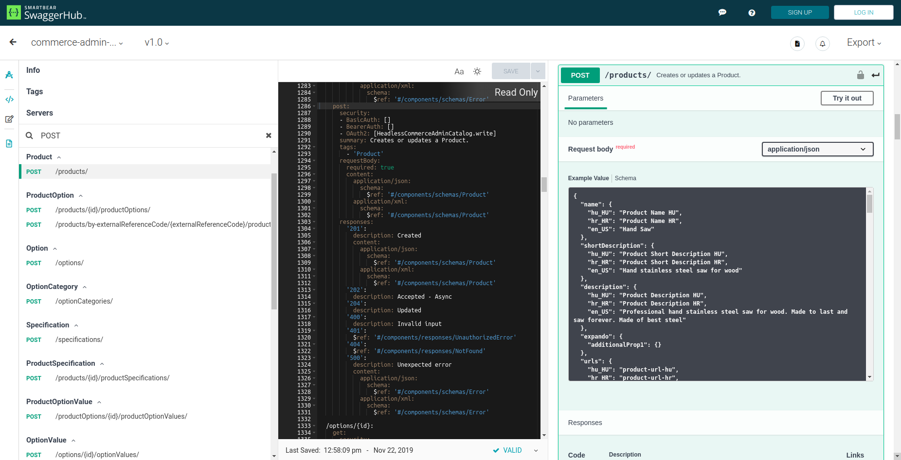
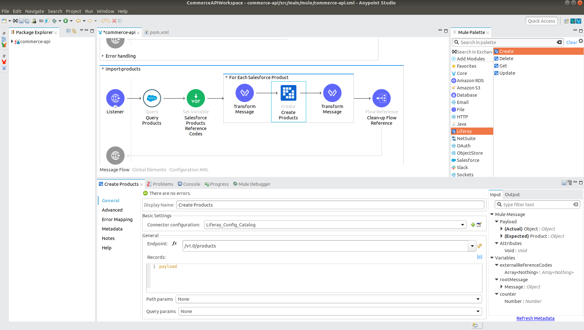

= Liferay Connector

== Overview
The Anypoint Liferay Connector lets you connect Liferay with other
platforms and services in the Mulesoft ecosystem or simply leverage
Liferay's APIs in a more user-friendly way.

In this user guide we will explain the main concepts behind the design of
Liferay connector and you will also learn how to set up and configure a basic
flow using a Liferay connector.

== Prerequisites
This document assumes that you are familiar with Mule and Anypoint Studio.
To increase your familiarity with Studio, consider completing an Anypoint Studio
Tutorial. This page requires basic knowledge of Mule Concepts, Elements in a
Mule Flow, and Global Elements.

For connector prerequisites check link:release-notes.adoc[release notes].

== Liferay Connector Design
Liferay Connector is designed to be dynamically configured with OpenAPI 3.0
documents that are used to describe all Liferay APIs. You can find Liferay
OpenAPI documents at the following link:
https://app.swaggerhub.com/organizations/liferayinc

Each OpenAPI document is also deployed dynamically in your Liferay portal
instance under following schema:
....
http://[host]:[port]/o/[headless-api-app-name]/[version]/openapi.json
....
This OpenAPI document is dynamically generated based on your RESTful web
service implementation code, therefore it is the most current and accurate
description of your APIs. More about Liferay APIs can be found at
https://portal.liferay.dev/docs/7-1/tutorials/-/knowledge_base/t/get-started-discover-the-api

Once you specify OpenAPI document endpoint, Liferay connector will be
dynamically configured with paths, path/query parameters and entity metadata
defined in the OpenAPI document.

Liferay connector is designed to work with any OpenAPI 3.0 document that was
designed following Liferay standards. With this approach, all Liferay APIs are
supported with single Liferay connector.

== Connector Configuration
To configure Liferay connector you need to:

. Select authentication method and enter required authentication parameters
. Specify OpenAPI document endpoint

You can choose between *Basic* and *OAuth2* authentication methods.
(Read more about authentication methods at
https://portal.liferay.dev/docs/7-1/tutorials/-/knowledge_base/t/making-authenticated-requests)

Basic Authentication::
* Enter *Username* and *Password* pair.

OAuth2::
* Enter *Client Key* and *Client Secret* pair.
+
Liferay supports OAuth 2.0 Client Credentials grant type. To connect Liferay
connector to Liferay instance using OAuth 2.0 protocol you need to supply
*Client ID* (Client Key) and *Client Secret* (Client Secret).
If you haven't done it already, you also need to set up OAuth2 authorization in
your Liferay instance by following the next steps:

** Open *Control Panel* > *OAuth 2 Administration*
** Click plus sign (*+*) in  the right upper corner to create new OAuth 2
application entry
** In *client profile* select *Headless Server* (do this first as it would setup
correct UI)
** Set *Application Name*
** Make sure *Client Credentials* checkbox is checked
** Click *save*
+
At this point, you have available Client ID (*Consumer Key*) and Client Secret
(*Consumer Secret*) that will be used in your Liferay connector configuration.
Before you can start using endpoints with OAuth2 authorization you also need to
enable Scopes:

** Click on *Scopes* tab (if it's not already on your screen, go to Control
Panel > OAuth2 Administration and edit your newly created OAuth2 application)
** Unwind desired scope and check authorization options you need (
_everything_, _everything.write_ or _everything.read_)
** Click *save*

Specify OpenAPI Document::
Once you have entered authorization parameters all that's left to do is to
specify which Liferay API you want to use. As we mentioned in the previous
section you achieve that by specifying the OpenAPI document endpoint which
describes desired API. For example if you'd like to use Commerce
Admin Catalog API you would enter
http://[host]:[port]/o/headless-commerce-admin-catalog/v1.0/openapi.json into
*OpenAPI Spec URL* field.
[%hardbreaks]
* Configuration example with Basic authentication
```xml
 <liferay:config name="Liferay_Config_Catalog">
 <liferay:basic-connection _username=${username} _password=${password} _openApiSpecPath="http://localhost:8080/o/headless-commerce-admin-catalog/v1.0/openapi.json"/>
 </liferay:config>
```

* Configuration example with OAuth 2.0
```xml
 <liferay:config name="Liferay_Config_Catalog">
    <liferay:oauth2-connection _consumerKey="${consumerKey}" _consumerSecret=${consumerSecret} _openApiSpecPath="http://localhost:8080/o/headless-commerce-admin-catalog/v1.0/openapi.json"/>
 </liferay:config>
```

If *Test Connection* is successful you can start building flows using Liferay
connector!

== Operations
After you have created new Mule project, imported and configured Liferay
connector, it's time to build your Mule flows using Liferay connector
operations. Operations enable you to *Create*, *Delete*, *Get* and *Update*
resources defined by your OpenAPI document. Each operation implements and
exposes different parts of the specified OpenAPI document which will be
explained in detail below.

Create Operation::
Create operation exposes all endpoints that are manipulated by POST HTTP method.
+
On the next picture, you can see SwaggerHub UI with the definition of
"/products" endpoint which is used to create a new product using POST HTTP
method. On the right side you can see available path parameters, request body
structure and all possible responses.
+

+
The following picture shows that same endpoint being used with Liferay
connector's Create operation in a flow that imports products from Salesforce
into Liferay Commerce. Once you select desired endpoint from the Endpoint
dropdown list, the connector will dynamically generate related Metadata which
can be seen in the bottom right corner.
+

+
Next, we will define input parameters. Keep in mind input parameters are
designed in a way to support all Liferay RESTful web services and don't have to
be used with every endpoint:
+
[%header,cols=4*]
|===
|Parameter name
|Type
|Description
|Required

|Endpoint
|String
|Drop down list of available endpoints that support create operation
|Yes

|Records
|Object
|Object to be created
|Yes

|Path Params
|Object
|Map with path parameter values
|Yes (if required by endpoint)

|Query Params
|Object
|Map with query parameter values
|No
|===

Delete Operation::
Delete operation exposes all endpoints that are manipulated by DELETE HTTP
method. Input parameters:
+
[%header,cols=4*]
|===
|Parameter name
|Type
|Description
|Required

|Endpoint
|String
|Drop down list of available endpoints that support delete operation
|Yes

|Path Params
|Object
|Map with path parameter values
|Yes (if required by endpoint)

|Query Params
|Object
|Map with query parameter values
|No
|===

Get Operation::
Get operation exposes all endpoints that are manipulated by GET HTTP
method. Input parameters:
+
[%header,cols=4*]
|===
|Parameter name
|Type
|Description
|Required

|Endpoint
|String
|Drop down list of available endpoints that support get operation
|Yes

|Path Params
|Object
|Map with path parameter values
|Yes (if required by endpoint)

|Query Params
|Object
|Map with query parameter values
|No
|===

Update Operation::
Update operation exposes all endpoints that are manipulated by PATCH HTTP
method. Input parameters:
+
[%header,cols=4*]
|===
|Parameter name
|Type
|Description
|Required

|Endpoint
|String
|Drop down list of available endpoints that support update operation
|Yes

|Records
|Object
|Object to be updated
|Yes

|Path Params
|Object
|Map with path parameter values
|Yes (if required by endpoint)

|Query Params
|Object
|Map with query parameter values
|No
|===

It is recommended to use
https://app.swaggerhub.com/organizations/liferayinc as documentation for Liferay
connector operations to see all available path/query parameters, request body
examples, expected success and error responses, etc..
You can also use the OpenAPI document from the endpoint you defined in
connector configuration, in which case you lose the helpful UI offered by
SwaggerHub editor.